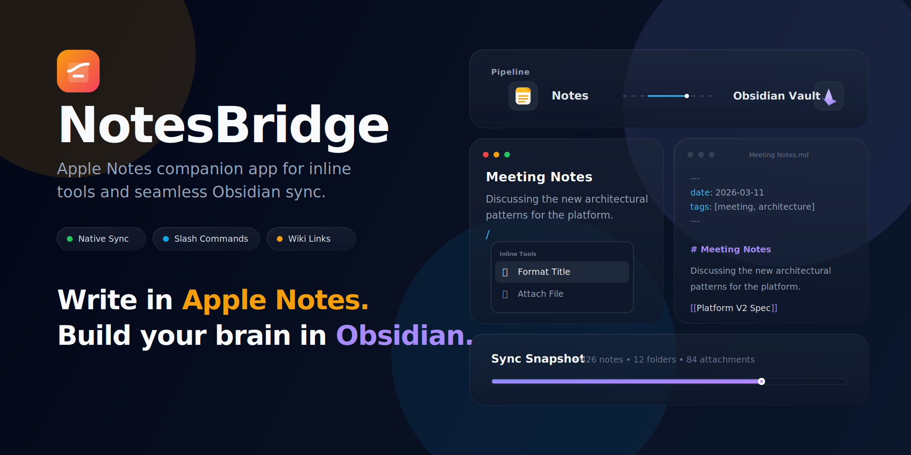

# NotesBridge

[English](./README.md) | [简体中文](./README.zh-CN.md) | [Français](./README.fr.md)

[](https://github.com/peizh/NoteBridge/actions/workflows/ci.yml)
[](https://github.com/peizh/NoteBridge/stargazers)
[](https://github.com/peizh/NoteBridge/network/members)
[](./LICENSE)



NotesBridge is a native macOS companion for Apple Notes. It runs as a menu bar app, adds inline editing enhancements on top of Apple Notes, and exports notes into an Obsidian vault.

## Project status

NotesBridge is under active development. The direct-download macOS build is the primary experience, and Apple Notes integration currently depends on local macOS permissions and direct access to the Apple Notes data container.

## What this prototype does

- Runs as a menu bar companion with a lightweight settings window.
- Watches Apple Notes when it is frontmost and the editor is focused.
- Shows a floating formatting bar above selected text in supported builds.
- Converts line-start markdown/list triggers into native Apple Notes formatting commands.
- Supports slash commands with inline exact-match execution and a floating suggestions menu.
- Syncs Apple Notes into an Obsidian vault with front matter metadata and native attachment export.

## Product constraints

Apple Notes does not expose a public plugin or extension API. NotesBridge therefore behaves as a companion app rather than a true in-app Notes extension.

The current implementation is intentionally conservative:

- Inline enhancements rely on Accessibility and event synthesis, so the direct-download build is the primary vehicle for the full experience.
- The App Store flavor can be simulated by launching with `NOTESBRIDGE_APPSTORE=1`, which disables inline Apple Notes enhancements and leaves settings/sync features active.
- Apple Notes -> Obsidian is still the primary sync direction.
- Slash command keyboard navigation may require Input Monitoring; if interception is unavailable, exact commands plus space and mouse-click selection still work.
- Full-note sync prompts for the macOS `group.com.apple.notes` data folder so NotesBridge can read the Apple Notes database and attachment files directly.

## Build and run

```bash
./scripts/run-bundled-app.sh
```

This is the recommended development entrypoint. It builds the SwiftPM executable, wraps it into a signed `NotesBridge.app`, and launches the bundled app from `~/Library/Application Support/NotesBridge/NotesBridge.app`.

The bundled app now uses a stable designated requirement so Accessibility and Input Monitoring can stay attached across rebuilds. If you previously granted an older NotesBridge build and the app still shows `Required`, remove the old entry in System Settings once and add the current bundled app again.

For quick non-bundled runs you can still use:

```bash
swift run
```

But `swift run` launches a bare executable, so macOS permission flows that depend on a real app bundle, especially Input Monitoring for slash menu keyboard navigation, will not behave correctly there.

If you only want to rebuild the `.app` without launching it:

```bash
./scripts/run-bundled-app.sh --build-only
```

On first bundled launch, macOS may ask for Accessibility and Automation permissions so NotesBridge can watch Apple Notes and sync its content. The first full sync also asks you to choose `~/Library/Group Containers/group.com.apple.notes` so the app can read NoteStore.sqlite and binary attachments.

## Release for users

For end users, the recommended distribution path is a direct-download macOS app bundle.

- Build a release app bundle with `./scripts/build-release-app.sh`
- Package it for download as a ZIP archive
- Sign it with `Developer ID Application`
- Notarize it with Apple and staple the ticket before upload

The repository now includes:

- `./scripts/build-release-app.sh` for release bundle creation
- `./scripts/package-release-zip.sh` for direct-download packaging
- `./scripts/notarize-release.sh` for notarization and stapling
- `.github/workflows/release.yml` for GitHub Actions release builds

Example local release build:

```bash
NOTESBRIDGE_SIGN_IDENTITY="Developer ID Application: Your Name (TEAMID)" \
NOTESBRIDGE_TEAM_ID="TEAMID" \
NOTESBRIDGE_VERSION="1.0.0" \
NOTESBRIDGE_BUILD_NUMBER="100" \
./scripts/build-release-app.sh
```

To notarize, also provide:

```bash
export NOTESBRIDGE_NOTARIZE=1
export APPLE_ID="you@example.com"
export APPLE_TEAM_ID="TEAMID"
export APPLE_APP_SPECIFIC_PASSWORD="app-specific-password"
./scripts/build-release-app.sh
```

The final direct-download artifact is produced in `./dist/` and can be uploaded to a GitHub Release for users to install.

## Suggested next steps

1. Harden selection anchoring and formatting-bar placement across multiple displays and fullscreen spaces.
2. Add a richer sync index and incremental note change tracking.
3. Package separate direct-download and App Store deliverables from the same codebase.

## License

MIT. See [LICENSE](./LICENSE).
