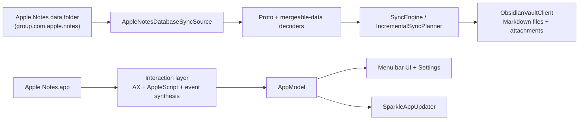

# Repository Architecture Review

Updated for the current repository layout on 2026-03-24.

This document replaces an older generated review that referenced retired build scripts and a removed `obsidian-importer/` subproject. The current repository is a single Swift macOS app with a small set of helper scripts.

## Snapshot

- Product: `NotesBridge`, a macOS menu bar companion app for Apple Notes.
- Primary runtime: SwiftUI/AppKit executable built with Swift Package Manager.
- Main jobs:
  - augment Apple Notes editing with slash commands, markdown-style triggers, and a floating formatting bar
  - sync Apple Notes into local Markdown files, folders, front matter, attachments, internal links, tables, and scan exports
- Current packaging entry point: `./scripts/notesbridge.sh`

## Repository Layout

| Path | Purpose |
| --- | --- |
| `Sources/NotesBridge/App/` | App startup, launch mode handling, app model, top-level app wiring |
| `Sources/NotesBridge/Domain/` | Settings, sync records, build flavor, update state, document models |
| `Sources/NotesBridge/Interaction/` | Accessibility-driven inline editing, slash commands, selection monitoring, formatting execution |
| `Sources/NotesBridge/Services/` | Apple Notes decoding, sync planning, markdown rendering, vault export, persistence, Sparkle integration |
| `Sources/NotesBridge/Support/` | Logging, localization, bundled-app relaunch support, shared style helpers |
| `Sources/NotesBridge/Views/` | Settings UI, menu bar UI, customization sheets |
| `Tests/NotesBridgeTests/` | Unit and UI-style tests for sync, rendering, settings, launch behavior, and export |
| `scripts/notesbridge.sh` | Canonical local build, bundle, release, notarize, appcast, and release-note workflow |
| `scripts/recreate_apple_notes_test_data.py` | Fixture generator for Apple Notes sync test data |
| `scripts/preview-pages.sh` | Convenience wrapper for previewing the static site with Playwright |
| `scripts/playwright-cli.sh` | Browser automation helper used by preview tooling |
| `site/` | GitHub Pages site content |
| `docs/sparkle-key-setup.md` | Sparkle signing key and update feed setup notes |

## Runtime Architecture

## Main Flows

### Inline editing

1. `NotesContextMonitor` watches the frontmost Apple Notes editor state through Accessibility APIs.
2. `SlashCommandEngine`, `MarkdownTriggerEngine`, and `FormattingCommandExecutor` decide whether to transform the user input.
3. `FloatingFormattingBarController` and related views present selection-based formatting actions.
4. `PermissionsManager` gates Input Monitoring and Accessibility dependent features.

### Sync and export

1. `AppleNotesDatabaseSyncSource` reads Apple Notes SQLite data and attachment references from the selected group container.
2. `AppleNotesNoteProtoDecoder` decodes note bodies and attribute runs from Apple Notes protobuf payloads.
3. `AppleNotesMergeableDataConverter` converts rich embedded objects such as Apple Notes tables and scan galleries into markdown fragments.
4. `IncrementalSyncPlanner` decides whether to export all notes, changed notes, or removed notes.
5. `ObsidianVaultClient` writes markdown files, front matter, attachments, and internal links into the target vault.

Recent sync note:

- Apple Notes table fragments now emit the markdown table body without padding blank lines, so synced markdown no longer inserts extra empty paragraphs before or after tables.

### Packaging and release

1. `./scripts/notesbridge.sh dev` builds a debug app bundle in `~/Library/Application Support/NotesBridge/NotesBridge.app` and launches it.
2. `./scripts/notesbridge.sh bundle` produces a local `.app` bundle, generates icons, embeds Sparkle, and codesigns the app.
3. `./scripts/notesbridge.sh release` builds the release app, packages the zip, and can optionally notarize.
4. `./scripts/notesbridge.sh appcast` and `./scripts/notesbridge.sh release-notes` support Sparkle feed publishing and GitHub release notes.

## Local Commands

| Command | Use |
| --- | --- |
| `./scripts/notesbridge.sh dev` | Build and launch the local bundled app |
| `./scripts/notesbridge.sh dev --build-only` | Build the bundled app without launching |
| `swift run` | Fast executable-only checks |
| `swift test` | Primary fast test pass |
| `xcodebuild -scheme NotesBridge -workspace .swiftpm/xcode/package.xcworkspace -destination 'platform=macOS' test` | Full macOS test pass used in CI |
| `./scripts/notesbridge.sh release` | Build release artifacts |
| `./scripts/notesbridge.sh release-notes <version>` | Extract changelog-backed release notes |

Important:

- `./scripts/run-bundled-app.sh` is no longer present in the repository.
- Use `./scripts/notesbridge.sh dev` anywhere older docs or notes mention the removed wrapper script.

## CI and Delivery

- `.github/workflows/ci.yml`
  - runs `swift test`
  - runs the Xcode macOS test pass
- `.github/workflows/release.yml`
  - derives release metadata
  - builds release artifacts through `./scripts/notesbridge.sh release`
  - uploads the app bundle zip
  - publishes GitHub release notes from `CHANGELOG.md`
  - updates the Sparkle appcast on `gh-pages`
- `.github/workflows/pages.yml`
  - publishes `site/` to GitHub Pages

## Dependencies

- Swift package dependencies:
  - `SwiftSoup` for HTML parsing and HTML-to-markdown related transforms
  - `Sparkle` for direct-download update support
- The repository does not currently contain a TypeScript importer package or any `obsidian-importer/` directory.

## Constraints and Notes

- The full inline-editing experience depends on macOS Accessibility and, for some features, Input Monitoring.
- Real-world permission behavior should be validated with the bundled app flow rather than `swift run`.
- The app is intentionally local-first: sync today is Apple Notes to local markdown, not bidirectional.
- `scripts/notesbridge.sh` is the canonical command surface. New build or release workflows should be added there instead of introducing more one-off shell entry points.
